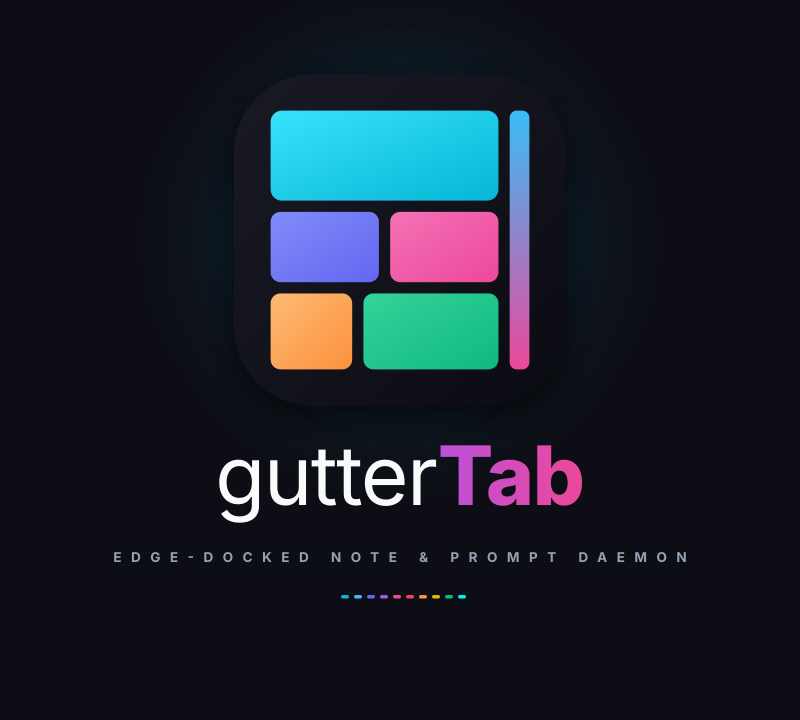

<p align="center">
  
</p>

# gutterTab v1.0: High-Performance Linux Edge-Docked Note & Prompt Daemon

  
-333333?style=flat-square) 

**gutterTab** is a specialized, bare-metal Linux desktop daemon and markdown scratchpad engineered exclusively for X11 environments. It manages your notes, AI prompt templates, and code snippets behind sleek, razor-thin, animated edge gutters acting as physical binder tabs docking to the side of your display.

Rather than managing chaotic floating sticky notes, alt-tabbing through dozens of open text editors, or relying on cloud-based web apps with high latency, `gutterTab` treats your screen edge as an expansive physical binder. The active note occupies a stunning, slide-out Markdown editor overlay in the center of the display, while the rest of your system remains completely unobstructed and clickable thanks to native X11 XShape 1-bit input masking.

With a simple flick of the mouse to the screen edge, your customized arsenal of context-specific notes instantly cascades open. Click the top-docked **Bento Dashboard** button, and watch your tabs gracefully fly out into a stunning masonry grid layout across your screen for ultimate visibility.

---

## Key Features

- **X11 Shape Click-Through Overlay**: Runs as a full-screen, frameless, transparent overlay using native X11 XShape 1-bit input masking (`XShapeCombineRectangles`). Clicks pass through seamlessly to underlying desktop windows everywhere except on the active tab strips and editor overlay.
- **Binder Tab Navigation**: Tabs stack vertically along the screen edge with configurable rest (`2px`), hover (`26px`), and peek (`30px`) widths, complete with binder-style overlap layering and smooth property animations.
- **Multi-Profile Architecture**: Isolate distinct workflows (e.g., Development, Client Notes, System Administration) with unique profiles, each having its own SQLite database, JSON settings, and attachment storage.
- **Rich-Text Editor**: Integrated slide-out editor supporting native HTML rich-text formatting (perfectly preserving user spacing and newlines), real-time zero-latency persistence, legacy Markdown clipboard export, and direct clipboard image pasting (auto-saved to the profile's disk attachments folder).
- **Folder Shortcuts Overlay**: Quick access to your project directories natively. A dedicated gutter button opens a styled masonry grid of alphabetical folder shortcuts that let you set custom brand mark icons. Clicking a folder opens it instantly in your native X11 file manager.
- **Zero-Latency Database Persistence**: Structured SQLite storage with schema migrations, automatic ordering index updates, and transaction boundaries.

---

## Architectural Overview

`gutterTab` follows Domain-Driven Design (DDD) principles, segregating responsibilities across three decoupled layers:

```
src/
├── domain/            # Core business models and state machines
│   ├── Note.h         # Note entity definition and attributes
│   ├── FolderShortcut.h # Folder entity definition and path pointers
│   ├── TabController.h# Central domain state coordinator (IDLE, PEEKING, OPEN, DASHBOARD, FOLDERS)
│   └── TabController.cpp
├── infrastructure/    # Concrete system implementations and data storage
│   ├── ConfigManager.h# Profile registry and per-profile JSON configuration
│   ├── ConfigManager.cpp
│   ├── DatabaseManager.h# SQLite storage, CRUD, and index reordering
│   └── DatabaseManager.cpp
└── presentation/      # Qt6 UI widgets and X11 system integration
    ├── OverlayWindow.h# Full-screen transparent widget managing XShape input masks
    ├── GutterStrip.h  # Vertical stacking container managing tab geometry & Z-ordering
    ├── GutterTab.h    # Individual tab widget with rotated text painting and animations
    ├── DashboardButton.h # Button for Bento dashboard layout
    ├── FoldersButton.h # Button for Folder shortcuts layout
    ├── BentoDashboard.h # Masonry grid overlay for notes
    ├── FoldersOverlay.h # Full-screen overlay to manage folder paths natively
    ├── NoteEditorOverlay.h # Slide-in editor container with formatting actions
    ├── MarkdownEditor.h    # QTextEdit subclass handling clipboard images and Markdown
    ├── ProfilePickerWindow.h # Standalone modal dialog for profile selection/management
    ├── SleekDialogs.h # Frameless dark-themed input, color, and context menu dialogs
    └── SleekSideChooserDialog.h # Edge selection dialog (Left vs Right screen edge)
```

For comprehensive details on internal systems mechanics, consult [ARCHITECTURE.md](ARCHITECTURE.md).

---

## System Requirements

- **Operating System**: Linux with an active X11 display server (tested on Debian 12 / Crunchbang++ under Openbox).
- **Compiler**: C++17 compliant compiler (GCC 9+ or Clang 10+).
- **Build System**: CMake 3.16 or later.
- **Dependencies**:
  - `Qt6` (Core, Gui, Widgets, Sql with SQLite driver)
  - `libxcb`
  - `xcb-ewmh`
  - `xcb-shape` (or X11 XShape extension)
  - `pkg-config`

### Installing Dependencies on Debian/Ubuntu

```bash
sudo apt-get update
sudo apt-get install -y \
    build-essential \
    cmake \
    pkg-config \
    qt6-base-dev \
    libqt6sql6-sqlite \
    libxcb1-dev \
    libxcb-ewmh-dev \
    libxcb-shape0-dev \
    libx11-dev \
    libxext-dev
```

---

## Building and Running

### Build via CMake

```bash
# Clone or navigate to the project directory
cd /path/to/gutterTab

# Configure and compile
cmake -B build -DCMAKE_BUILD_TYPE=Release
cmake --build build -j$(nproc)
```

### Running the Application

```bash
./build/gutterTab
```

---

## Profile & Storage Architecture

All user configuration, databases, and image assets are isolated within the XDG standard directory (`~/.config/gutterTab`):

```
~/.config/gutterTab/
├── profiles.json              # Global registry of profiles and auto-launch default
└── profiles/
    └── <profile-uuid>/
        ├── config.json        # Edge preference, tab widths, and UI settings
        ├── notes.db           # SQLite database storing notes and sort ordering
        └── attachments/       # Pasted image attachments referenced in notes
```

---

## License & Development Guidelines

All contributions must comply with the engineering directives outlined in [AGENT.md](AGENT.md):
- Strict adherence to SOLID principles.
- Mandatory RAII memory safety (zero unmanaged raw owning pointers).
- Comprehensive Doxygen documentation (`@brief`, `@details`, `@note`, `@param`, `@return`).
- Non-blocking GUI operations and thread safety invariants.
